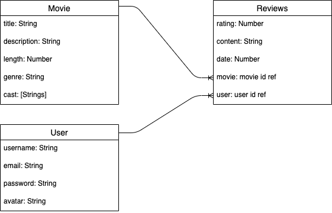

# Project-1---Reverse-Engineer
# Title: Bad Apple
by Jenna Waffensmith & Dan Bae

# Scope
Our objective is to reverse engineer a web app similar to Rotten Tomatoes. The user will be able to browse through our site to see information about a certain movie and what other people thought about it with reviews. If the user should wish, they will have the opportunity to register and login to our app to join the community and submit their own review as well. The features of our site will be:

1. an index page where all the movie cards will be held so the user can navigate to a specific title
2. a show page that will show the title that the user chose with information about the movie and where the reviews will be
3. within the show page, the user will be able to submit their own review for contribution and be able to edit and delete their review as well

Where we think we could possibly elevate our app is that to make our site more visually aesthetic. With javaScript and CSS we will give the user a more interactive way to view information about a movie title. On our index route, we will be showing cards of movie posters so the user can navigate through and when the user toggles the card, it will flip over to show the information about the title and provide the link to take them to the show page. We feel that this will provide a cleaner app that is more visually appealing.

# Wireframes
Index route - desktop

Index route - mobile

Show route - desktop

Show route - mobile

Create/edit review - desktop

Create/edit review - mobile

# Color Palette/Font
* Logo: #E34234 - Cinnabar
* Nav/Footer: #F2F1E8 - Ivory
* Card Background/ Review: #F2F1E8 - Ivory
* Background: #0D698B - Blue Grotto
* Text: #050533 - Dark Blue
* Font: 'Roboto', sans-serif

# REST/CRUD

# ERD

# User Stories

- [ ] The index route will show a static nav bar on top with the brand logo on the left, a search bar, and the register and login drop downs on the right. Below the nav will show the movie cards that will flip when toggled with the title link and description that can direct the user to the show page. On the bottom will be the footer with Jenna and Dan's credentials.
    - [ ] ejs layout of the index page with a nav bar, movie cards, and footer
    - [ ] REST routing to GET index page and show page
    - [ ] style index.ejs using bulma and style guide
    - [ ] create scripts for movie card animations

- [ ] The show route will allow the user to view a specific movie title that will show the description of the movie. It will have an option to create a review, that will be layed out below the movie description with other users reviews. Once the review has been created, it will populate along with other reviews, where the user will have the option to edit and delete with a drop down menu attached to the user reference. Create, edit and delete forms will be modals that will pop up. Page layout will have the same nav bar and footer.
    - [ ] ejs layout of the show route with nav bar, movie description, reviews and footer
    - [ ] REST routing to POST/PUT/DELETE reviews on page
    - [ ] style show.ejs using bulma and style guide

- [ ] User registration and login on the nav bar will be drop down menus with the corresponding forms. Once user is authenticated and authorized, the nav bar will show the user avatar showing that the user is logged in.
    - [ ] create forms for registration and login on both index.ejs and show.ejs
    - [ ] REST routing CREATE/PUT for both index and show depending on where the user is trying to register or login
    - [ ] style the forms for register and login
    - [ ] set up auth in server.js file and create auth controller

# Technology Packages:
1. npm
2. express
3. ejs
4. method-override
5. mongoose
6. sass
7. bulma
8. concurrently
9. dotenv
10. bcrypt (stretch)
11. session (stretch)
12. connect-mongo (stretch)